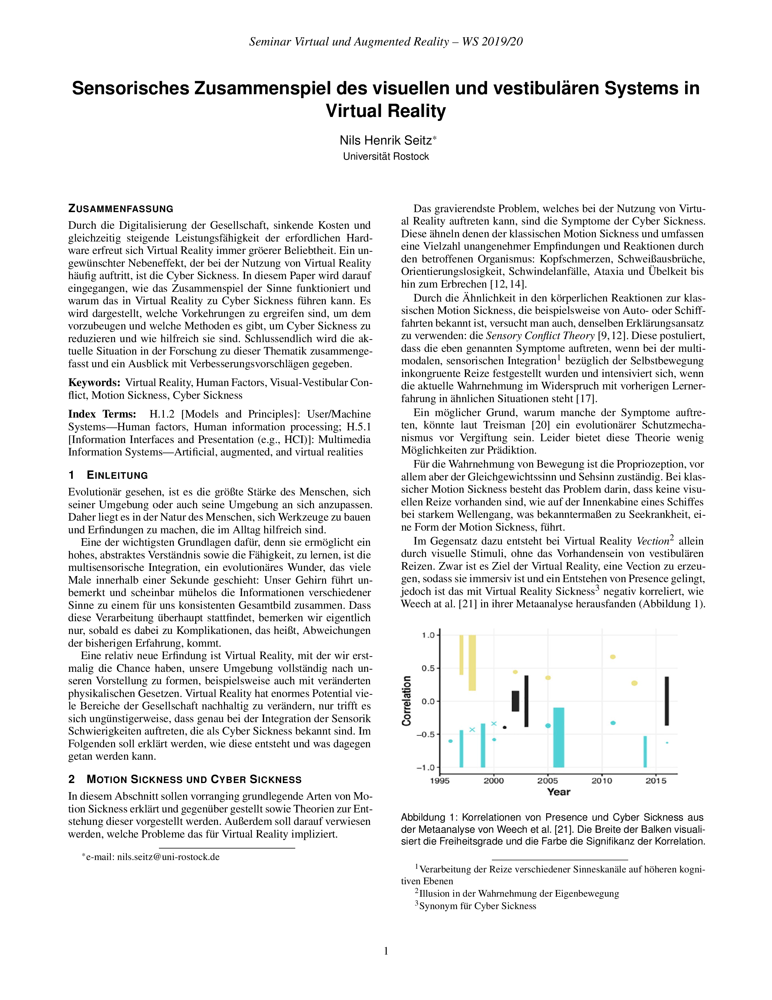
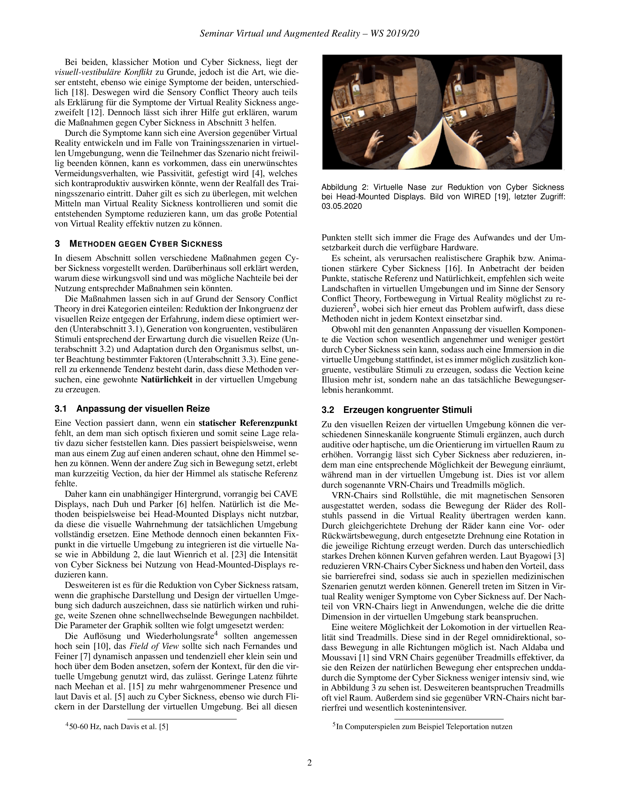

# Seminararbeit Virtual Reality

## Sensorisches Zusammenspiel des visuellen und vestibulären System

In Latex mit folgendem Template:
[IEEE TVCG Conference Style Template](https://www.overleaf.com/latex/templates/ieee-tvcg-conference-style-template/htqfqtgkvcqf)
<br>
GitHub-Repository ist eher als Cloudspeicher mit VCS gedacht.
<br>
ImageMagick-Conversion from .pdf to .png:
```
magick -density 300 "Seminararbeit_Sensorisches Zusammenspiel des visuellen und vestibulären System in VR.pdf"  -quality 100 -alpha on "pictures/paper.png" 
```
____
## Paper



